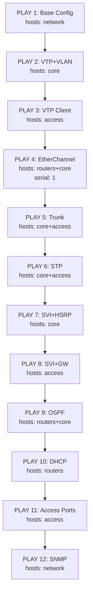

# Walkthrough: Dự án Tự động hóa Mạng Cisco với Ansible

## Tổng quan

Dự án triển khai cấu hình mạng Cisco (1 Router, 2 Core L3, 5 Access L2) từ **thiết bị trắng** đến **hoàn thiện**, chia thành 2 giai đoạn rõ rệt.

---

## Cấu trúc thư mục dự án

```
automation/
├── config-all/                           # [Có sẵn] File cấu hình mong muốn cuối cùng
│   ├── 00_SUMMARY.txt
│   ├── Router.txt, CORE-1.txt, CORE-2.txt
│   └── AC-1.txt ~ AC-5.txt
│
├── bootstrap/                            # [MỚI] Phần 1: Bootstrap Scripts
│   ├── 00_README.md                      # Hướng dẫn thứ tự triển khai
│   ├── 01_Router.ios                     # CLI bootstrap Router
│   ├── 02_CORE-1.ios                     # CLI bootstrap CORE-1
│   ├── 03_CORE-2.ios                     # CLI bootstrap CORE-2
│   ├── 04_AC-1.ios ~ 08_AC-5.ios         # CLI bootstrap Access switches
│
└── ansible-network/                      # [MỚI] Phần 2: Ansible Project
    ├── ansible.cfg                       # Cấu hình Ansible
    ├── inventory.ini                     # Inventory (routers, core, access)
    ├── site.yml                          # Master playbook (12 plays)
    ├── group_vars/
    │   ├── all.yml                       # Credentials, VLANs, SNMP chung
    │   ├── routers.yml                   # OSPF, DHCP, EtherChannel (Router)
    │   ├── core.yml                      # VTP mode, STP mode (Core)
    │   └── access.yml                    # VTP mode, default-gateway (Access)
    ├── host_vars/
    │   ├── Router.yml                    # IP WAN, static routes
    │   ├── CORE-1.yml                    # HSRP Active, STP Root, PO2/PO1
    │   ├── CORE-2.yml                    # HSRP Standby, STP Secondary, PO3/PO1
    │   └── AC-1.yml ~ AC-5.yml           # Uplink/downlink, VLAN assignment
    ├── roles/
    │   ├── 01_base/tasks/main.yml        # Hostname, credentials, VTY
    │   ├── 02_vtp/tasks/main.yml         # VTP Server/Client
    │   ├── 03_vlan/tasks/main.yml        # VLAN database (Core only)
    │   ├── 04_trunk/tasks/main.yml       # Trunk ports Core↔Access
    │   ├── 05_etherchannel/tasks/main.yml # LACP PO1/PO2/PO3
    │   ├── 06_stp/tasks/main.yml         # Rapid-PVST+, Root priority
    │   ├── 07_svi_hsrp/tasks/main.yml    # SVI + HSRP v2 + helper-address
    │   ├── 08_ospf/tasks/main.yml        # OSPF Area 0
    │   ├── 09_dhcp/tasks/main.yml        # DHCP Server + pools
    │   ├── 10_access_ports/tasks/main.yml # Downlink ports + PortFast
    │   └── 11_snmp/tasks/main.yml        # SNMP traps → Zabbix
    └── playbooks/                        # Playbooks riêng lẻ
        ├── pb_vtp.yml, pb_stp.yml
        ├── pb_etherchannel.yml, pb_hsrp.yml
        ├── pb_ospf.yml, pb_dhcp.yml
        └── pb_snmp.yml
```

---

## PHẦN 1: Bootstrap Scripts

### Mục đích
Cấu hình **tối thiểu** qua Console để Ansible Server kết nối được đến tất cả 8 thiết bị.

### Các thành phần Bootstrap cho mỗi thiết bị

| Thành phần | Router | CORE-1/2 | AC-1~AC-5 |
|-----------|--------|----------|-----------|
| Hostname | ✅ | ✅ | ✅ |
| Enable secret | ✅ | ✅ | ✅ |
| Line VTY 0 4 | ✅ | ✅ | ✅ |
| IP connectivity | e0/0: 192.168.9.99 | Standalone e0/0 → Router | — |
| Routed link | e0/1→CORE-1, e1/1→CORE-2 | 10.0.0.2 / 10.0.0.6 | — |
| VLAN 99 | — | ✅ + SVI | ✅ + SVI |
| Trunk uplinks | — | e1/0~e2/0 → Access | e0/0, e0/1 → CORE |
| Inter-core trunk | — | e0/2-3 | — |
| Static route | → 192.168.99.0/24 via CORE-1 | → 0.0.0.0/0 via Router | — |
| Default gateway | — | — | 192.168.99.2 (CORE-1 real IP) |

### Quyết định thiết kế quan trọng

1. **Standalone links thay vì EtherChannel**: Bootstrap dùng interface đơn (e0/0→Router) thay vì LACP EtherChannel. Ansible sẽ nâng cấp lên EtherChannel sau.

2. **Default gateway = CORE-1 real IP (.2)**: Không dùng HSRP VIP (.1) vì HSRP chưa hoạt động. Ansible sẽ đổi thành .1 sau khi HSRP được cấu hình.

3. **Static route tạm**: Router có static route đến VLAN 99 qua CORE-1, CORE switches có default route về Router. OSPF (Ansible) sẽ thay thế.

---

## PHẦN 2: Ansible Project

### Luồng thực thi site.yml (12 Plays)



### Giải thích Logic từng Role

| # | Role | Hosts | Module chính | Logic |
|---|------|-------|-------------|-------|
| 01 | base | all | ios_config | Hostname, enable secret, VTY — đảm bảo credentials đồng nhất |
| 02 | vtp | core+access | ios_config | Core=Server tạo VLAN, Access=Client nhận VLAN qua VTP |
| 03 | vlan | core | ios_vlans | Tạo VLAN 10/20/99/100 trên VTP Server, VTP đồng bộ xuống Client |
| 04 | trunk | core+access | ios_config | Mở đầy đủ allowed VLANs trên trunk (bootstrap chỉ cho VLAN 99) |
| 05 | etherchannel | routers+core | ios_config | Chuyển standalone links thành LACP PO1/PO2/PO3, xóa IP bootstrap |
| 06 | stp | core+access | ios_config | Rapid-PVST+, CORE-1=Root VLAN 10/20/99, CORE-2=Root VLAN 100 |
| 07 | svi_hsrp | core+access | ios_config | HSRP v2 trên Core (VIP .1), ip helper-address, Access default-gw |
| 08 | ospf | routers+core | ios_config | OSPF Area 0, xóa static routes tạm từ bootstrap |
| 09 | dhcp | routers | ios_config | 3 DHCP pools + excluded addresses trên Router |
| 10 | access_ports | access | ios_config | e1/0 access VLAN 10/20 + PortFast + BPDU Guard |
| 11 | snmp | all | ios_config | ACL→Zabbix, community RO, trap host, enable traps theo device type |

### Cách chạy

```bash
# Chạy toàn bộ
cd /mnt/Download/automation/ansible-network
ansible-playbook site.yml

# Chạy từng phần riêng
ansible-playbook playbooks/pb_vtp.yml
ansible-playbook playbooks/pb_etherchannel.yml
ansible-playbook playbooks/pb_hsrp.yml
ansible-playbook playbooks/pb_ospf.yml
ansible-playbook playbooks/pb_dhcp.yml
ansible-playbook playbooks/pb_snmp.yml
ansible-playbook playbooks/pb_stp.yml

# Check mode (dry-run)
ansible-playbook site.yml --check

# Kiểm tra kết nối
ansible network -m cisco.ios.ios_command -a "commands='show version'" 
```

### Xác minh sau triển khai

```bash
# VTP
ansible core -m cisco.ios.ios_command -a "commands='show vtp status'"

# STP
ansible core -m cisco.ios.ios_command -a "commands='show spanning-tree summary'"

# EtherChannel
ansible routers:core -m cisco.ios.ios_command -a "commands='show etherchannel summary'"

# HSRP
ansible core -m cisco.ios.ios_command -a "commands='show standby brief'"

# OSPF
ansible routers:core -m cisco.ios.ios_command -a "commands='show ip ospf neighbor'"

# DHCP
ansible routers -m cisco.ios.ios_command -a "commands='show ip dhcp binding'"

# SNMP
ansible network -m cisco.ios.ios_command -a "commands='show snmp host'"
```

---

## Tổng kết

| Metric | Số lượng |
|--------|---------|
| Files tạo mới | **42 files** |
| Bootstrap scripts | 9 (1 README + 8 device scripts) |
| Ansible roles | 11 |
| Ansible playbooks | 8 (1 master + 7 individual) |
| Group vars | 4 files |
| Host vars | 8 files |
| Thiết bị quản lý | 8 (1 Router + 2 Core + 5 Access) |
